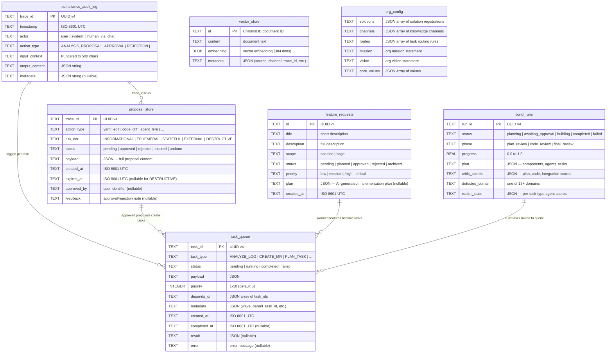

# SAGE Framework — Entity Relationship Diagram

## Overview

SAGE uses SQLite for runtime state (audit log, proposals, task queue) and ChromaDB for vector memory. Each solution gets its own `.sage/` directory with isolated databases.

---

## Core Data Models (Mermaid)



## Data Flow Summary

| Store | Location | Purpose |
|---|---|---|
| `compliance_audit_log` | `.sage/audit_log.db` | Immutable append-only compliance record |
| `proposal_store` | `.sage/audit_log.db` (same DB) | Pending HITL proposals with risk tiers |
| `task_queue` | `.sage/audit_log.db` (same DB) | Task scheduling and execution tracking |
| `feature_requests` | `.sage/audit_log.db` (same DB) | Improvement backlog per solution |
| `vector_store` | `.sage/chroma_db/` | ChromaDB vector knowledge store |
| `build_runs` | In-memory (BuildOrchestrator) | Build pipeline state |
| `org_config` | `solutions/org.yaml` | Multi-solution org configuration |

## Per-Solution Isolation

Every solution gets its own `.sage/` directory:

```
solutions/
  medtech_team/
    project.yaml
    prompts.yaml
    tasks.yaml
    .sage/                    # auto-created, gitignored
      audit_log.db            # proposals, approvals, audit trail
      chroma_db/              # vector knowledge store
  automotive/
    .sage/                    # completely separate databases
      audit_log.db
      chroma_db/
```

Two solutions on the same SAGE instance have zero data overlap.

## Key Relationships

- **trace_id** links audit log entries to proposals and back to vector memory feedback
- **task_id** connects queue entries to their subtasks (wave scheduling)
- **parent_task_id** in task metadata links subtasks to parent wave tasks
- **solution name** scopes all data — audit log, vector store, proposals, feature requests
- **X-SAGE-Tenant header** further scopes within a solution for multi-team isolation

## Audit Log Action Types

| Action Type | Source | Description |
|---|---|---|
| `ANALYSIS_PROPOSAL` | POST /analyze | Agent generated analysis proposal |
| `APPROVAL` | POST /approve | Human approved a proposal |
| `REJECTION` | POST /reject | Human rejected a proposal |
| `FEEDBACK_LEARNING` | POST /reject | Rejection feedback stored in vector memory |
| `MR_REVIEW` | POST /mr/review | AI code review completed |
| `MR_CREATED` | POST /mr/create | Merge request created |
| `MR_CREATE_FAILED` | POST /mr/create | MR creation failed |
| `WEBHOOK_RECEIVED` | POST /webhook/* | Inbound webhook processed |
| `TASK_SUBMITTED` | POST /tasks/submit | Task added to queue |
| `TASK_COMPLETED` | Queue worker | Task execution completed |
| `KNOWLEDGE_ADDED` | POST /knowledge/add | Knowledge entry added |
| `KNOWLEDGE_DELETED` | DELETE /knowledge/entry | Knowledge entry removed |
| `BUILD_STARTED` | POST /build/start | Build run initiated |
| `BUILD_DRIFT_WARNING` | Build orchestrator | Anti-drift checkpoint fired |
| `CHAT_ACTION` | POST /chat/execute | Chat-initiated action executed |
| `AGENT_HIRED` | POST /agents/hire | New agent role proposed |

## Elder Fall Detection ERD

For the `elder_fall_detection` solution, a PostgreSQL schema with HIPAA-compliant encryption is defined. See `solutions/elder_fall_detection/` for the full schema including:

- `users` — PII encrypted via pgcrypto (name, email, phone, emergency contacts)
- `devices` — device registry with owner/status tracking
- `fall_events` — fall detection events with encrypted GPS coords
- `gps_history` — continuous telemetry with encrypted lat/lon
- `audit_log` — solution-specific append-only audit trail
- Row-Level Security (RLS) policies per role (admin, wearer, caregiver, system)
