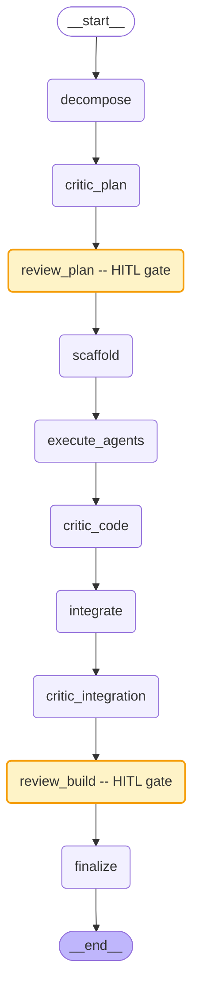
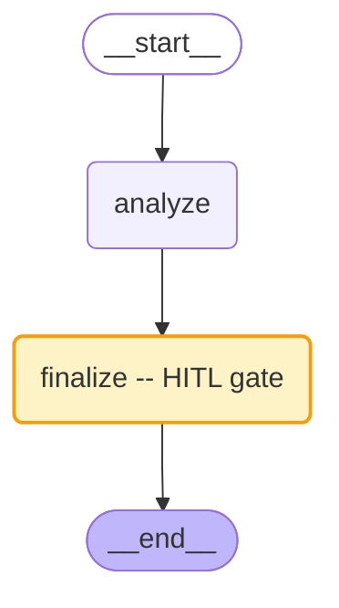
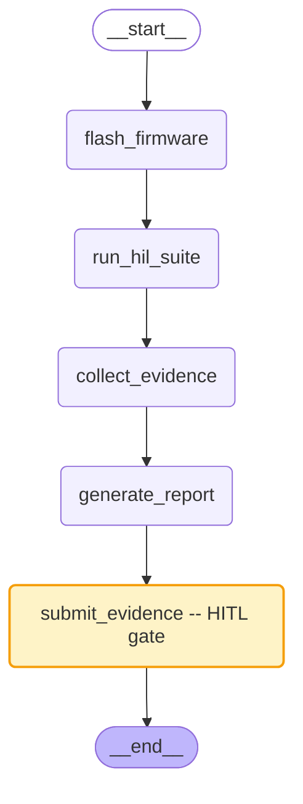
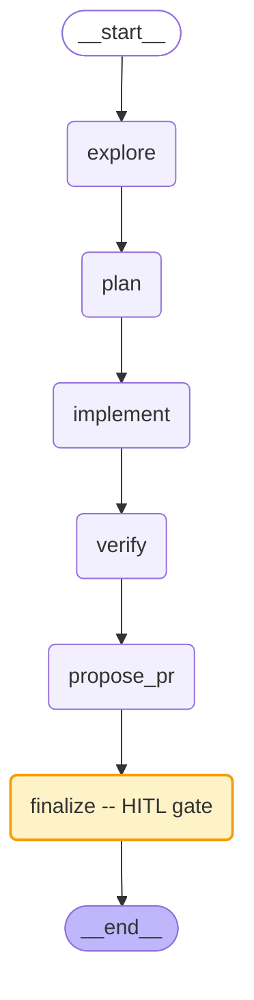

# SAGE LangGraph Workflow Diagrams

Generated from compiled LangGraph StateGraph workflows using `workflow.get_graph().draw_mermaid()`.

Nodes with `__interrupt = before` are HITL gates — the workflow pauses before that node for human approval.

---

## 1. Build Workflow (0->1->N Pipeline)

**File:** `solutions/starter/workflows/build_workflow.py`
**HITL gates:** `review_plan`, `review_build`



**Flow:** Decompose description into tasks -> Critic reviews plan -> Human approves plan -> Scaffold directories -> Execute agents (parallel waves) -> Critic reviews code -> Integrate -> Critic reviews integration -> Human approves build -> Finalize

---

## 2. Analysis Workflow (Minimal HITL Pattern)

**File:** `solutions/starter/workflows/analysis_workflow.py`
**HITL gates:** `finalize`



**Flow:** AI analyzes input -> Human reviews analysis -> Finalize (store feedback in vector memory)

---

## 3. HIL Workflow (Hardware-in-the-Loop Regulated Testing)

**File:** `solutions/starter/workflows/hil_workflow.py`
**HITL gates:** `submit_evidence`



**Flow:** Flash firmware -> Run HIL test suite -> Collect evidence (logs, traces) -> Generate regulatory report -> Human approves evidence -> Submit to audit log (DHF/TCF)

---

## 4. SWE Workflow (Autonomous Coding Agent)

**File:** `solutions/starter/workflows/swe_workflow.py`
**HITL gates:** `finalize`



**Flow:** Explore codebase (README, file tree, tech stack) -> Plan changes (LLM-generated TODO list) -> Implement file-by-file -> Verify (targeted tests) -> Propose PR (branch + commit + optional GitHub PR) -> Human approves -> Finalize (audit log)

---

## Viewing These Diagrams

These Mermaid diagrams render natively in:
- GitHub Markdown preview
- VS Code with Mermaid extension
- Any Mermaid live editor (mermaid.live)

To regenerate from code:
```python
from solutions.starter.workflows.build_workflow import workflow
print(workflow.get_graph().draw_mermaid())
```
